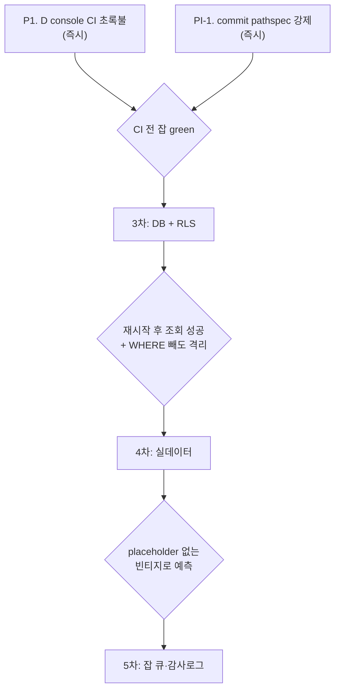

# SellFinder 실행 계획

> [!info] 이 문서의 성격
> **관측된 사실**과 **앞으로의 계획**을 분리해서 적는다.
> 사실은 `git log`·CI 실행 결과·`verification/FINDINGS.md` 에서 뽑았고 근거를 커밋 해시로 단다.
> 계획에는 **왜 그 순서인지**와 **무엇으로 끝났다고 판정할지**를 반드시 함께 적는다.
> 진행 이력은 [[TIMELINE]], 설계 배경은 [[Study]], 확정 결정은 [[DECISIONS]] 참조.

---

## 1부. 지금 어디까지 왔나 (사실)

### 1.1 제품은 이제 실제로 예측을 만든다

2차 사이클의 목표가 이것이었고 달성했다.

| 시점 | 상태 |
|---|---|
| 1차 사이클 종료 | 지도는 칠해지는데 **점수가 하드코딩된 데모**였다 |
| **2차 사이클 종료** | `POST /predictions` → 잡 워커가 B 의 `predict_batch` 호출 → 실제 점수 |

`_build_demo_regions()` 가 삭제됐고, 검증 5회차가 종료조건 4개 전부 PASS 로 판정했다.

### 1.2 검증 7회차까지 진행, 미해결은 사실상 없다

| 지표 | 값 |
|---|---|
| 누적 종결 | **16건** (VF-001 ~ VF-016) |
| 미해결 | S4 수준 소수 |
| 확인 불가 | **2건** — 둘 다 DB 부재가 원인 |

### 1.3 CI 는 돌고 있고, 게이트 하나가 가짜였던 것도 잡혔다

7개 잡 중 **6개 green**, `D - console` 만 실패 중이다.

> [!success] 핵심 게이트가 실제로 작동하는 것이 확인됐다
> 검증자가 7회차에서 CI 를 감사했다. `git worktree` 로 격리 사본을 만들어
> `ci.yml` 에 적힌 명령을 문자 그대로 재현하는 방식이었다(원격 CI 를 트리거하면
> 공유 상태에 영향을 주므로 그렇게 하지 않았다 — 지시 범위를 정확히 지킨 판단이다).
>
> - `seam`(조인) — **진짜로 작동한다**
> - `mutation`(변이) — 작동, CI 에서 PASS 확인
> - `privacy-and-honesty` — **절반이 가짜였다 (VF-017, S2)**.
>   T0 검사가 실제 파이프라인에 대해 **상시 통과**였다. 발견 즉시 픽스처를 고쳐 닫았다.

**내가 만든 게이트가 가짜였다는 것을 다른 역할이 잡아냈다.** 이 구조가 작동한다는 증거다.

### 1.4 지금 열려 있는 문제 넷

| # | 문제 | 성격 | 담당 |
|---|---|---|---|
| P1 | `D - console` CI 실패 (테스트 탐색) | 즉시 처리 | D |
| P2 | **세션 간 git 인덱스 오염** — B 작업이 A 커밋에 흡수됨 | **구조적 결함** | 총괄자 |
| P3 | RLS 미적용 (스키마 스테이징까지 완료, 승인 대기) | 대기 중 | C + jin |
| P4 | 잡 큐 없음 — `202` 를 반환하지만 같은 프로세스에서 계산 | 미착수 | C |

---

## 2부. 앞으로의 목표

### 목표 설정의 원칙

> [!important] 사이클마다 **한 문장으로 말할 수 있는 목표** 하나만 둔다
> 1차: *"지도가 칠해지는가"* → 2차: *"예측이 생성되는가"*
> 목표가 둘 이상이면 임계 경로가 흐려지고, 16시간 정체 같은 일이 다시 생긴다.

---

## 3차 사이클 — **"예측이 살아남는가"**

**한 문장**: 서버를 재시작해도 예측이 남아 있고, 테넌트 격리가 DB 레벨에서 강제된다.

### 왜 지금 이것인가

세 가지 이유가 겹친다.

1. **지금 예측은 프로세스 메모리에만 있다.** `prediction_store` 가 파이썬 딕셔너리다.
   재시작 한 번이면 전부 사라진다. 실사용은커녕 데모도 위험하다.
2. **확인 불가 2건이 전부 DB 부재 때문이다.** `06_governance.md` §1.2 는 RLS 를 DB 레벨에
   요구하는데, DB 가 없으니 검증자가 1회차부터 지금까지 "확인 불가"로 남겨두고 있다.
   **검증할 수 없는 조항은 지켜지고 있다고 말할 수 없다.**
3. **나중에 하면 더 비싸다.** 인메모리 전제로 코드가 더 쌓이면 이관 비용이 커진다.
   지금은 저장소 계층이 얇다.

### 무엇을 하는가

| 단계 | 내용 | 완료 판정 |
|---|---|---|
| 3-1 | PostgreSQL 스키마 + 마이그레이션 러너 | 빈 DB 에서 마이그레이션만으로 기동 |
| 3-2 | `prediction_store` 를 DB 구현으로 교체 | **재시작 후에도 같은 `run_id` 조회 성공** |
| 3-3 | `tenant_id` 를 DB 세션 변수로 주입 + RLS 정책 | 아래 §진짜 판정 참조 |
| 3-4 | CI 에 postgres 서비스 컨테이너 추가 | CI 에서 DB 테스트가 실제로 돎 |

> [!danger] RLS 의 진짜 판정 기준
> "테넌트가 분리되는가"로 판정하면 **애플리케이션 `WHERE` 절만으로도 통과한다.**
> 진짜 판정은 이것이다 — **`WHERE tenant_id = ...` 를 일부러 빼고 쿼리했을 때도
> 다른 테넌트 데이터가 나오지 않는가.** 나오면 RLS 가 아니라 그냥 조심한 것이다.
> 이 기준은 검증자에게 미리 전달했다.

### 위험과 대응

> [!warning] 이 작업의 가장 큰 위험은 "조용히 반쯤 적용된 RLS" 다
> 테이블 10개 중 9개에 정책을 걸고 1개를 빠뜨리면, 평소에는 아무 일도 안 일어난다.
> **대응**: 정책이 걸리지 않은 테이블을 찾는 테스트를 쓴다.
> "모든 테이블에 RLS 가 켜져 있는가"를 카탈로그(`pg_class.relrowsecurity`)에서 직접 확인한다.
> 사람이 목록을 관리하면 언젠가 빠뜨린다.

---

## 4차 사이클 — **"실데이터 위에서 도는가"**

**한 문장**: 합성 데이터를 걷어내고 공개 데이터 위에서 예측이 나온다.

### 왜 3차 다음인가

실데이터를 먼저 넣으면 **저장할 곳이 없어서** 매번 다시 계산해야 한다.
그리고 실데이터는 양이 많아 인메모리로는 감당이 안 된다. 순서가 뒤바뀌면 두 번 일한다.

### 무엇을 하는가

| 단계 | 내용 | 완료 판정 |
|---|---|---|
| 4-1 | 경계: 이미 진행됨 (`admdongkor` 3개 레벨) | `is_synthetic_placeholder` 없는 빈티지 |
| 4-2 | 피처를 실제 출처로 전환 (인구·점포수 등) | 각 피처에 출처·갱신주기·`as_of` 명시 |
| 4-3 | `sbiz` 택소노미 매핑을 실데이터에 적용 | 매핑 없는 노드가 `confidence=low` 로 하향 |
| 4-4 | 실데이터로 백테스트 재실행, 모델 카드 갱신 | Spearman ρ·wMAPE·coverage 실측 |

> [!danger] 여기서 가장 위험한 것은 시점 정합성이다
> `as_of` 없이 "최신값"을 가져오는 헬퍼가 하나라도 있으면 **시한폭탄**이다.
> 언젠가 누가 그걸 학습에 쓰고, 미래 정보가 과거 예측에 섞인다.
> 그러면 백테스트 점수는 좋아지고 실전 성능은 나빠진다 — **가장 발견하기 어려운 종류의 버그다.**
> **대응**: 그런 헬퍼가 존재하는지 자체를 검사하는 테스트를 둔다.

---

## 5차 사이클 — **"운영할 수 있는가"**

**한 문장**: 전국 규모 예측을 실제로 돌려도 서비스가 멈추지 않는다.

| 단계 | 내용 | 왜 |
|---|---|---|
| 5-1 | 잡 큐 도입 (Celery/RQ/Arq) | 지금은 `202` 를 반환하고 **같은 프로세스에서 계산**한다 |
| 5-2 | 진행률·재시도·실패 상태 | 3,500개 지역 계산 중 실패하면 지금은 알 방법이 없다 |
| 5-3 | 감사 로그 + `request_id` | `06_governance.md` §3. 누가 무엇을 조회했는지 |
| 5-4 | 캐시 키에 `tenant_id` 포함 | D-17. 캐시를 통한 유출 경로 차단 |

---

## 3부. 프로세스 개선 (코드가 아닌 것)

### PI-1. 세션 간 git 인덱스 오염 — **가장 시급하다**

> [!bug] 실제로 일어난 일
> B 의 변경사항이 스테이징된 상태에서 **다른 세션이 pathspec 없이 `git commit` 을 실행**했다.
> 그 결과 B 의 작업(CI 의존성 감사, T1/T2 보정)이 `data-platform` 커밋 `8b0bd8d` 에 흡수됐다.
> 내용은 온전하고(90/90 테스트 통과) **데이터 손실은 없다.** 귀속이 틀린 것이다.

**왜 내 규칙으로 못 막았나**: 나는 "`git add -A` 금지, `git add <자기폴더>` 만"이라고 지시했다.
그런데 `git commit` 은 **pathspec 이 없으면 인덱스 전체를 커밋한다.** 남이 스테이징해둔 것까지.
즉 내 규칙은 절반만 막고 있었다.

**대응 선택지**

| 안 | 방법 | 장점 | 단점 |
|---|---|---|---|
| A | `git commit <경로>` 로 pathspec 명시 강제 | 즉시 적용, 비용 0 | 규칙 의존 — 또 빠뜨릴 수 있다 |
| B | **세션마다 `git worktree` 분리** | 인덱스가 물리적으로 분리됨 | 산출물 공유 경로를 재설계해야 함 |
| C | 커밋 직렬화(락 파일) | 확실 | 대기 발생, 구현 필요 |

**권고: A 를 즉시 적용하고, 3차 사이클과 함께 B 를 검토한다.**
A 는 오늘 바로 되고, B 는 이득이 크지만 A/C/D 가 서로의 산출물을 파일로 주고받는 지금 구조에서
경로 설계를 다시 해야 한다. 급하게 바꾸면 VF-003 같은 이음매 사고를 자초한다.

> [!tip] 이 사건에서 배울 것
> **B 는 히스토리를 고치지 않았다.** `amend`/`rebase` 로 정리할 수 있었지만,
> 다른 세션이 이미 그 커밋 위에 쌓고 있을 수 있어서 건드리지 않고 보고만 했다.
> **되돌리기보다 기록하기를 택한 것이 옳다.**

### PI-2. 게이트 감사를 주기적으로 한다

VF-017 이 보여줬듯 **CI 게이트도 가짜가 될 수 있다.** 그리고 가짜 게이트는
없는 게이트보다 나쁘다 — 초록불을 보고 아무도 확인하지 않게 되기 때문이다.

**규칙**: 게이트를 추가하거나 픽스처를 수정할 때마다 **고장을 주입해 빨간불을 확인**한다.
검증자가 3회차마다 CI 전체를 감사한다.

### PI-3. 문서 간 모순 검사

VF-003 의 원인은 계약 문서 **내부**의 모순이었다. 지금은 사람이 읽어야만 발견된다.
같은 대상을 두 곳에서 설명하는 문장을 찾는 간단한 린트라도 있으면 재발을 줄인다.

---

## 4부. 실행 순서와 판정

### 마일스톤 판정 기준

| 마일스톤 | 판정 방법 | 판정 주체 |
|---|---|---|
| **M1** CI 전면 green | `gh run list` 최신 실행이 success | 총괄자 |
| **M2** 영속성·격리 | 재시작 후 `run_id` 조회 + `WHERE` 제거 격리 시험 | **검증자** |
| **M3** 실데이터 | `is_synthetic_placeholder` 0건 + 백테스트 실측치 | **검증자** |

> [!important] 판정은 만든 사람이 하지 않는다
> M2·M3 를 C 나 A 가 스스로 판정하면 그건 자기 보고다.
> 이 프로젝트에서 자기 보고와 실제가 어긋난 사례가 반복해서 나왔다.

---

## 5부. 다음 한 걸음

지금 당장 할 것은 셋이다.

- [ ] **P1** — D 가 console 테스트 탐색을 고쳐 CI 를 green 으로 (진행 중)
- [ ] **PI-1** — 모든 세션에 `git commit <경로>` pathspec 명시 지시 (총괄자, 즉시)
- [ ] **P3** — C 의 RLS 설계안 검토 후 3-1 착수 승인 (jin/총괄자)

그다음은 3차 사이클 발령(`DISPATCH-3.md`)이다.
발령 시에는 1·2차에서 효과가 확인된 방식을 그대로 쓴다 —
**임계 경로 명시 · 착수 조건을 에이전트가 직접 확인 가능한 형태로 · 완료 판정을 명령 출력으로 요구.**
