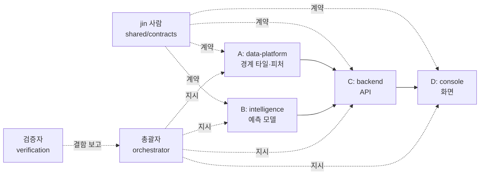
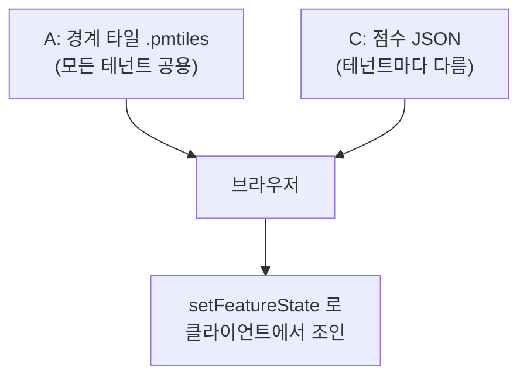

# SellFinder 설계 강의

> [!abstract] 이 문서는 무엇인가
> SellFinder 프로젝트를 **초기 구상부터 현재까지** 따라가며, 각 시점에 **왜 그렇게 결정했는지**와
> **지금 다시 한다면 무엇을 바꿀지**를 정리한 강의 노트다.
> 코드를 처음 보는 사람도 읽을 수 있도록 개념부터 설명하고, 매번 **이 저장소의 실제 파일과 커밋**을 근거로 든다.

> [!info] 읽는 법
> - 각 강의는 **개념 → 이 프로젝트의 실제 사례 → 더 나은 방법** 순서다.
> - `파일:줄번호` 는 실제 위치다. 열어보면서 읽는 것을 권한다.
> - `abc1234` 는 커밋 해시다. `git show abc1234` 로 원본을 볼 수 있다.
> - 전체 진행 순서는 [[TIMELINE]] 에, 확정된 결정은 [[DECISIONS]] 에 있다.

---

## 0강. 이 제품이 무엇인지부터

### 개념

대부분의 "상권분석" 서비스는 이렇게 말한다. **"이 동네는 카페가 잘 됩니다."**
SellFinder 는 다르게 말한다. **"당신 회사의 이 제품이 이 동네에서 잘 팔립니다."**

차이가 사소해 보이지만 설계 전체가 갈린다.

| | 상권분석 툴 | SellFinder |
|---|---|---|
| 예측 단위 | 업종 (카페, 편의점) | **SKU** (그 회사의 특정 제품) |
| 사용자 | 창업자 | **기업의 영업·유통 담당자** |
| 데이터 | 공개 데이터만 | 공개 데이터 + **그 회사의 판매 데이터** |
| 답의 형태 | "여기 좋아요" | "이 제품을, 이 지역에, 이 채널로" |

> [!important] 예측의 키는 네 개다
> **(제품 × 지역 × 채널 × 기간)**
> 이 중 하나라도 빠진 응답은 계약 위반이다. → [[DECISIONS]] D-02

### 왜 이게 중요한가

"채널"을 예로 들자. 같은 커피 음료라도 **편의점**에서 팔릴 조건과 **온라인 마켓**에서 팔릴 조건이 다르다.
편의점은 유동인구가 중요하지만, 온라인은 유동인구와 아무 상관이 없다.

그래서 이 프로젝트에는 이런 규칙이 있다.

> [!warning] 온라인 채널 예측에 `foot_traffic`(유동인구)과 `competitor_density`(경쟁밀집도)를 넣지 않는다
> 넣으면 "강남역 근처 사람이 많으니 온라인에서도 잘 팔릴 것"이라는 **말이 안 되는 예측**이 나온다.
> 테스트로 강제한다: `intelligence/tests/test_factor_model.py`

#초보자팁 — 채널을 "나중에 필터로 거르면 되지 않나?"라고 생각하기 쉽다. 안 된다.
채널이 **모델 입력 자체**를 바꾸기 때문이다. 필터는 이미 계산된 결과를 고르는 것이고,
여기서는 계산 방법이 달라져야 한다.

---

## 1강. 왜 사람 하나가 아니라 에이전트 여섯으로 나눴나

### 개념: 콘텍스트는 유한하다

AI 에이전트 하나가 이 프로젝트 전체를 들고 있으면, 지도 코드를 고치는 동안 모델 코드를 잊는다.
사람도 마찬가지지만 AI 는 더 심하다. **대화가 끝나면 기억이 사라진다.**

그래서 역할을 쪼개고, **각자 자기 폴더만** 쓰게 했다.



| 역할 | 폴더 | 하는 일 |
|---|---|---|
| **A** | `data-platform/` | 행정경계 타일, 지역 피처 |
| **B** | `intelligence/` | 예측 모델, 백테스트 |
| **C** | `backend/` | API 서버 |
| **D** | `console/` | 웹 화면 |
| **총괄자** | `orchestrator/`, `tools/` | 조율. **코드는 안 짠다** |
| **검증자** | `verification/` | 결함 탐지. **코드는 안 고친다** |
| **jin (사람)** | `shared/contracts/` | 계약 결정. **여기만 사람이 쓴다** |

### 왜 총괄자와 검증자가 코드를 안 짜는가

> [!question] 총괄자가 코드를 짜면 왜 안 되나?
> 조율할 사람이 없어지기 때문이다. 총괄자가 버그를 고치기 시작하면 그 순간부터
> "누가 무엇을 기다리는지" 보는 사람이 아무도 없다.

> [!question] 검증자가 버그를 고치면 왜 안 되나?
> 자기가 고친 코드를 자기가 검증하게 된다. **채점자가 답안을 쓰면 채점이 무의미하다.**

#핵심 — 역할 분리는 능력의 문제가 아니라 **이해상충**의 문제다.

### 더 나은 방법

> [!tip] 개선안
> - **역할별 콘텍스트 파일**을 자동 주입하라. 지금은 각 세션이 `RECONCILIATION.md` 를 직접 읽어야
>   하는데, 세션이 새로 뜰 때마다 사람이 알려줘야 한다.
> - **폴더 경계를 CI 에서 강제하라.** 지금은 `tools/validate_contracts.py --agent A` 로 검사할 수 있지만
>   자동으로 돌지 않는다. 실제로 B 의 보고서가 총괄자 폴더에 들어온 적이 있다 (`c5deeb0`).

---

## 2강. 계약 우선 설계 (Contract-First)

### 개념

여러 명이 동시에 개발할 때 가장 흔한 사고는 이것이다.

> "저는 `region_id` 를 문자열로 보냈는데요?"
> "저는 숫자로 받는 줄 알았는데요?"

이걸 막는 방법이 **계약을 코드보다 먼저 파일로 고정**하는 것이다.

```
shared/contracts/
├── 00_product_spec.md      무엇을 만드는가
├── 01_domain_model.json    엔티티와 필드
├── 02_taxonomy.json        상품·채널 분류
├── 03_region_features.json 지역 피처 목록
├── 04_api_contract.yaml    REST API (OpenAPI)
├── 05_scoring_spec.md      점수 계산 규칙
├── 06_governance.md        테넌트 격리·개인정보
└── ADR-001 ~ ADR-005       중요한 결정 기록
```

> [!important] 절대 규칙
> **계약은 `shared/contracts/` 파일뿐이다.**
> 다른 에이전트의 구현 코드는 계약이 아니다. → [[DECISIONS]] D-10

이 규칙이 왜 필요한지 실제 사고가 있었다. A 가 C 의 코드를 읽고 **그것을 계약으로 오해해서**
자기 파이프라인을 되돌릴 뻔했다. C 의 코드는 그냥 C 의 구현이었을 뿐인데.

### ADR 이란

**ADR = Architecture Decision Record (설계 결정 기록)**

"왜 이렇게 했는지"를 남기는 문서다. 형식은 단순하다.

1. **문제**: 무엇이 막혔나
2. **결정**: 무엇으로 정했나
3. **근거**: 왜 다른 선택지를 버렸나
4. **영향**: 누가 무엇을 바꿔야 하나

> [!example] ADR-005 의 실제 구조
> - 문제: 타일과 점수가 조인이 안 된다 (5개 중 0개 매칭)
> - 결정: `region_id` 를 타일 속성(properties)에 문자열로 싣는다
> - 근거: 정수 변환 방식은 선행 0·2⁵³ 초과·해시 충돌이라는 **조용한 실패 경로 3종**을 만든다
> - 영향: A 는 타일 수정, C 는 하드코딩 제거, D 는 **변경 없음**

#핵심 — **기각한 선택지와 그 이유를 반드시 적는다.** 안 적으면 6개월 뒤 누군가 같은 논쟁을 다시 시작한다.

### 더 나은 방법

> [!tip] 개선안
> - **계약 문서끼리의 모순을 자동 검사하라.** 5강에서 볼 사고가 정확히 이것 때문에 났다.
> - **계약 버전과 구현의 대응을 기계적으로 확인하라.** 지금은 `04_api_contract.yaml` 의 `version: 0.2.2` 를
>   코드가 참조하지 않는다. 구현이 어느 버전을 따르는지 아무도 모른다.

---

## 3강. 지도는 어떻게 그리는가 (ADR-001)

### 개념: 벡터 타일이란

지도를 웹에 그리는 방법은 크게 둘이다.

| 방식 | 설명 | 문제 |
|---|---|---|
| **GeoJSON** | 경계 좌표를 통째로 JSON 으로 전송 | 전국 행정동 3,500개면 수십 MB. 브라우저가 죽는다 |
| **벡터 타일** | 지도를 바둑판으로 잘라 보이는 칸만 전송 | 초기 구축이 복잡 |

SellFinder 는 **PMTiles** 라는 벡터 타일 형식을 쓴다. 파일 하나에 모든 타일이 들어 있어서
서버 없이 CDN 에 올려두고 브라우저가 필요한 부분만 잘라 읽는다.

### 핵심 결정: 경계와 점수를 분리한다



> [!warning] 왜 서버에서 합치면 안 되나
> 경계와 점수를 하나의 타일로 구우면 **테넌트 × 예측실행 × 줌레벨** 조합마다 타일을 새로 만들어야 한다.
> 조합이 폭발하고 **CDN 캐시가 불가능해진다.**
> 경계는 모두에게 같으므로 한 번 만들어 영원히 캐시하고, 점수만 따로 받아 브라우저에서 합친다.

#초보자팁 — `setFeatureState` 는 "이미 그려진 지도 도형에 색칠 정보만 나중에 붙이는" 기능이다.
도형(경계)과 색(점수)을 따로 받아 브라우저에서 합치는 것이다.

### 빈티지(vintage)라는 개념

행정구역은 바뀐다. 동이 합쳐지고 이름이 바뀐다.
그래서 "2026년 1월 1일 기준 경계"처럼 **시점을 붙여서** 보관한다. 이것이 빈티지다.

> [!danger] 빈티지를 덮어쓰면 안 되는 이유
> 작년에 계산한 예측을 오늘 최신 경계 위에 그리면, **없어진 동에 점수가 붙고 새 동은 비어 있다.**
> 조용히 어긋나므로 아무도 눈치채지 못한다. → [[DECISIONS]] D-08

---

## 4강. 가장 중요한 사고 — VF-003

> [!bug] 증상
> 네 에이전트의 테스트가 **전부 통과**하고 계약 검증기도 통과하는데,
> 실제로 붙여보니 **지도 전체가 회색**이었다. 에러도 경고도 없었다.

### 무슨 일이 있었나

검증자가 A 의 실제 타일 파일 + C 의 실제 응답 + D 의 실제 조인 코드를 붙여 실행했다.

```
manifest.feature_id_property = "region_id"
tile feature ids (A, real)   = 11, 26, 28, 41, 50
tile feature properties keys = ["name","level","is_synthetic_placeholder"]   ← region_id 가 없다!
features that received a score : 0/5
```

D 는 타일 속성에서 `region_id` 를 찾는데, A 의 타일에는 그 속성이 **없었다.**

### 원인: 계약 문서 안에 서로 반대되는 두 문장

`ADR-001-map-tiles.md` 한 파일 안에 이렇게 적혀 있었다.

| 위치 | 문장 | 읽은 사람 |
|---|---|---|
| 117행 | "`feature_id_property` 를 `setFeatureState` 키로 쓴다" | **D** |
| 157행 | "`region_id` 를 **속성이 아니라 feature id 로** 넣는다" | **A** |

> [!important] 결론
> **A 도 D 도 틀리지 않았다. 둘 다 자기 문서를 정확히 지켰다.**
> 틀린 것은 계약이었다.

157행은 MapLibre 의 `promoteId` 라는 기능(속성을 id 로 승격시키는 표준 방법)을 모르는 채 쓰였다.
그 기능이 있으므로 "속성이 아니라 id 여야 한다"는 전제 자체가 성립하지 않았다.

### 여기서 배울 것 세 가지

1. **자기 폴더만 초록불인 것은 아무 의미가 없다.**
   통합을 실제로 실행해본 주체가 생기기 전까지 아무도 몰랐다.
2. **모순의 출처가 사람이 아니라 문서일 수 있다.**
   이럴 때 개발자를 탓하면 멀쩡한 구현이 되돌려진다.
3. **조용한 실패가 가장 위험하다.**
   에러가 났으면 5분이면 찾았다. 회색 지도는 "데이터가 없나 보다"로 넘어간다.

> [!tip] 개선안
> - **이음매(seam)마다 테스트를 둔다.** 만든 사람이 아니라 **이음매 자체**가 테스트를 갖는다.
> - 계약 문서에 같은 대상을 두 번 설명하지 않는다. 설명이 두 곳에 있으면 언젠가 갈라진다.
> - 조인 실패를 **조용히 넘기지 말고 경고를 찍는다.** 0건 매칭은 정상 상태가 아니다.

---

## 5강. 점수 모델 — 승법 요인 모델

### 개념

이 프로젝트의 예측은 **곱셈**으로 이루어진다.

```
예상 수요 = 기준값 × f₁ × f₂ × ... × f₈
```

여기서 `f` 는 요인(factor)이다. 8개가 고정돼 있고 이름을 바꿀 수 없다.
예를 들어 `addressable_demand`(도달 가능 수요), `competition`(경쟁), `price_acceptance`(가격 수용도) 같은 것들이다.

#초보자팁 — 왜 덧셈이 아니라 곱셈인가?
"경쟁이 심하면 수요가 **절반으로 준다**"처럼 현실의 효과는 대개 **비율**이기 때문이다.
덧셈이면 "100 빼기"가 되어 기준값이 작을 때 음수가 나온다.

### 로그 합 불변식

곱셈에 로그를 취하면 덧셈이 된다.

```
log(예상 수요) = log(기준값) + log(f₁) + log(f₂) + ... + log(f₈)
```

각 요인의 `log(fᵢ)` 를 **기여도**라고 부르고 화면에 "이 지역이 유망한 이유"로 표시한다.

> [!important] 불변식: 기여도의 합 = 최종 배수의 로그 (오차 < 1e-6)
> 이게 깨지면 **화면에 보여준 설명이 실제 점수와 무관해진다.**
> 즉 **거짓 설명**을 파는 것이다. → [[DECISIONS]] D-04

### 검증 결과

검증자가 독립적으로 2,863건의 예측을 만들어 확인했다.

```
worst |sum - ln(total_multiplier)| = 1.110e-16    (계약 한계 1e-6)
violations: 0
```

**모델은 정상이었다.** 그런데 문제가 다른 데 있었다. 다음 강의다.

---

## 6강. 테스트가 가짜일 수 있다 (변이 테스트)

### 개념: 항등식 테스트

B 의 테스트는 이렇게 생겼었다.

```python
# 요인 기여도의 합이 최종 배수의 로그와 같은지 확인
assert abs(sum(f.log_contribution for f in factors) - log(total_multiplier)) < 1e-6
```

문제가 보이는가?

> [!bug] `total_multiplier` 자체가 `log_contribution` 들로부터 계산된다
> 즉 이 단언은 **항상 참**이다. `a = b` 로 정의해놓고 `a == b` 인지 확인하는 것과 같다.
> 계산이 틀려도 통과한다.

### 변이 테스트(Mutation Testing)로 증명하기

검증자가 코드를 **일부러 망가뜨린 뒤** 테스트가 잡는지 확인했다.

| 변이 | 무엇을 망가뜨렸나 | 결과 |
|---|---|---|
| M1 | 기여도를 소수 2자리로 반올림 | **통과** ← 못 잡음 |
| M2 | 한 요인의 기여도만 ×0.5 | **통과** ← 못 잡음 |
| M3 | 요인 하나를 출력에서 제거 | 실패 ← 잡음 |

**분해를 거짓으로 만드는 두 변이가 12개 테스트를 모두 통과했다.**

### 해결: 외부 증인

합에서 파생되지 **않은** 값과 대조하면 된다.
예를 들어 화면에 표시되는 `display_effect`(실제 배수에서 계산됨)나 `value/benchmark` 비율이다.

```
독립 검사 적용 후: M2 → worst dev = 3.674e-01 → FAIL (잡힘)
```

> [!tip] 배울 것
> **"테스트가 있다"와 "테스트가 무언가를 막는다"는 다른 말이다.**
> 자기 테스트를 믿기 전에 코드를 일부러 망가뜨려보라. 안 깨지면 그 테스트는 장식이다.
> - [ ] 연습: 자기 프로젝트에서 테스트 하나를 골라 대상 함수의 `return` 을 상수로 바꿔보라

---

## 7강. 정직성 규칙 — "모르면 null"

### T0 / T1 / T2 티어

| 티어 | 뜻 | 할 수 있는 것 |
|---|---|---|
| **T0** | 자사 판매 데이터 없음 | 상대적 랭킹만 |
| **T1** | 일부 있음 | 금액 추정 가능 |
| **T2** | 충분함 | 정밀 추정 |

> [!danger] T0 에는 금액을 반환하지 않는다 (`null` 고정)
> 판매 데이터가 없는 회사에 "월 3,200만원 예상"이라고 말하는 것은
> **근거 없는 숫자를 파는 것**이다. → [[DECISIONS]] D-03

### 실제로 벌어진 일: 한 겹만 막았다

C 는 금액을 잘 막았다. 그런데 검증자가 T0 로 조회해보니:

```
rows with non-null expected_revenue_krw : 0        ← 금액은 정상
confidence levels : ['high','high','medium','medium','low']
above ceiling (=='high') : 2                       ← 계약은 T0 상한이 medium
```

**금액은 막고 신뢰도는 안 막았다.** 데이터가 없는데 "높은 신뢰도"라고 말한 것이다.

### 같은 실수가 세 번 반복됐다

| 번호 | 무엇을 막았나 | 무엇이 뚫렸나 |
|---|---|---|
| VF-005 | 금액 | **신뢰도 상한** |
| VF-010 | API 응답 | **로그와 에러 메시지** |
| VF-013 | 값 자체 | **정렬 순서** |

VF-013 이 특히 교묘하다. 다음 강의에서 따로 다룬다.

> [!tip] 개선안
> **차단을 경로마다 걸지 말고, 차단된 뷰를 한 번 만들어 이후 모든 처리가 그것만 보게 하라.**
> 그래야 새 경로(내보내기, 웹훅 등)가 생겨도 자동으로 막힌다.

---

## 8강. 부채널(Side Channel) — 값은 가렸는데 순위가 샌다

### 개념

**부채널 유출**이란 데이터를 직접 보여주지 않았는데 **다른 통로로 정보가 새는 것**이다.

### 실제 사례 (VF-013)

인구가 너무 적은 지역은 개인이 특정될 수 있어 `suppressed`(억제) 처리한다.
값은 `null` 로 잘 가렸다. 그런데 정렬 코드가 이랬다.

```python
if sort in ("revenue_desc", "profit_desc"):
    regions.sort(key=lambda r: r.expected_revenue_p50 or -1, reverse=True)
```

정렬 키가 **가리기 전 원본값**이다.

> [!bug] 그래서 무슨 일이 일어나는가
> 응답의 금액은 `null` 인데, **그 지역이 목록 1위로 올라온다.**
> 사용자는 "값은 못 보지만 이 동네가 제일 크구나"를 알게 된다.
> 값을 가린 의미가 사라진다.

#초보자팁 — 시험 점수를 안 알려주면서 **석차만 알려주는 것**과 같다. 점수를 가린 게 아니다.

> [!tip] 개선안
> 정렬·필터·페이지네이션·집계는 **전부 차단 후 값 위에서** 수행한다.
> "이 값을 화면에 보여주는가"가 아니라 **"이 값이 결과의 순서나 개수에 영향을 주는가"**를 물어야 한다.

---

## 9강. 검증자라는 발명 — "믿지 말고 실행하라"

### 왜 필요했나

이 프로젝트에는 이미 기계적 검사가 둘 있었다.

- `tools/validate_contracts.py` — 스키마·형식 검사
- `tools/status_sweep.py` — 커밋·파일 존재 검사

**둘 다 통과하면서 깨져 있는 영역이 네 종류** 남는다. 그게 검증자의 사냥터다.

| 유형 | 실제 모습 |
|---|---|
| **거짓 완료** | "구현 완료" 커밋인데 함수 본문이 `pass` 나 하드코딩 |
| **빈 테스트** | 이름은 그럴듯한데 단언이 없거나 항상 참 (6강) |
| **미추적 조항** | 계약에 적혀 있는데 아무 테스트도 강제하지 않음 |
| **통합 불일치** | 양쪽 다 계약 통과인데 붙이면 안 맞음 (4강) |

### 검증자의 규칙

> [!important] 확인된 것만 보고한다
> **그럴듯한데 틀린 지적 20개는 없는 것보다 나쁘다.**
> 다른 사람의 시간을 태우고, 그다음부터 아무도 그 보고를 안 믿는다.
> 모든 지적에는 **재현 명령**이 붙어야 한다.

```
❌ "테넌트 격리에 문제가 있어 보입니다"
✅ "security.py:14 가 헤더만 검사한다.
    재현: curl -H 'Authorization: Bearer tnt_A' '/v1/...?tenant_id=tnt_B'
    결과: 200 (400 이어야 함)
    근거: 06_governance.md §1.1"
```

### 판정하는 쪽도 틀린다

이 프로젝트에서 실제로 두 번 있었다.

- **총괄자 오류**: 게이트를 "`.pmtiles` 가 하나도 커밋되면 안 된다"로 썼는데,
  결정 D-12 는 픽스처 타일을 **커밋하라**고 정하고 있었다. 규칙을 지킨 A 를 위반으로 읽을 뻔했다. (`648669c`)
- **검증자 오류**: 이미 커밋된 코드를 "미커밋"으로 판정했다. 다음 회차에 **스스로 찾아 정정**했다. (`dbe8ddb`)

> [!tip] 배울 것
> 검사하는 도구도 틀린다. 실제로 상태 보고 도구가 과거 회차의 결함까지 합산해서
> **"미해결 15건"이라고 거짓 보고**한 적이 있다(실제 2건). 도구도 검증 대상이다.

---

## 10강. 조율 — 진짜 적은 "낡음"

### 개념

여러 명이 병렬로 일할 때 가장 위험한 것은 실력 부족이 아니다.
**자기가 낡았다는 것을 스스로 알 수 없다는 것**이다.

> [!example] 실제 사례
> D 가 "backend 구현이 계약과 다르다"고 보고했다. 사실이었다 — **작성 시점에는.**
> 그 11분 뒤 C 가 계약대로 고쳤다. D 는 그걸 모른 채 자기 코드를 되돌릴 뻔했다.

이걸 기계적으로 잡는 방법이 **교차 신선도(cross-freshness)** 검사다.
소비자의 마지막 커밋이 생산자의 산출물보다 이르면 낡음을 의심한다.

### 16시간 정체 사건

1단계가 끝난 시점에 네 에이전트가 **전부 "계약대로 끝냈다"** 상태였다.
그리고 **16시간 동안 아무도 커밋하지 않았다.**

능력이 부족해서가 아니었다. 각자 할 일은 알고 있었다.
없던 것은 **순서와 의존 관계**였다. 누가 무엇을 기다리는지 아무도 몰랐다.

지시서(`DISPATCH.md`)를 내리자 **90분 만에 12개 커밋**이 들어왔다.

> [!tip] 배울 것
> - 지시는 "무엇을"이 아니라 **"어떤 순서로, 무엇을 기다렸다가, 무엇으로 끝났다고 말하는가"**여야 한다.
> - 완료 판정을 **실행 명령과 그 출력**으로 요구하라. 안 그러면 "다 했습니다"만 돌아온다.
> - 착수 조건을 **본인이 확인 가능한 형태**로 줘라.
>   "총괄자가 알려줄 때까지 대기"는 총괄자가 멈추면 전체가 멈춘다.
>   "이 파일이 생기면 시작"은 아무도 안 멈춘다.

---

## 11강. 지금 이 코드의 약점 (정직한 목록)

> [!warning] 아래는 "언젠가 하면 좋은 것"이 아니라 **지금 실제로 비어 있는 것**이다

### 11.1 데이터베이스가 없다

`backend/app/services/prediction_store.py` 는 **파이썬 딕셔너리**다.
서버를 재시작하면 모든 예측이 사라진다.

이 때문에 검증할 수 없는 계약 조항이 있다.

> [!fail] RLS(Row Level Security) 미검증
> 계약은 "테넌트 격리를 **DB 레벨**에서 강제하라"고 요구한다.
> 애플리케이션 `WHERE` 절만으로는 **한 곳만 빠뜨려도 유출**된다.
> DB 가 없으니 이 조항은 지금 "확인 불가"다.

**개선**: PostgreSQL + Row Level Security 도입. `tenant_id` 를 DB 세션 변수에 넣고 정책으로 강제한다.

### 11.2 잡 큐가 없다

`POST /predictions` 는 202 를 반환하지만, 실제 계산은 **같은 프로세스 안에서** 일어난다.
전국 3,500개 행정동 × 여러 SKU 를 계산하는 동안 API 서버가 묶인다.

**개선**: Celery / RQ / Arq 같은 잡 큐 + 워커 분리. 재시도와 진행률도 여기서 나온다.

### 11.3 CI 가 없다 → **해결됨 (2026-08-16)**

> [!success] GitHub Actions 도입 (`8e047fe`)
> 폴더별 스위트 4개 + 계약 검증에 더해, **각 폴더가 자기 안에서만 맞는지 보는 검사로는 못 잡는**
> 게이트 3개를 넣었다: `seam`(조인), `privacy-and-honesty`(T0·테넌트), `mutation`(변이).
> 자세한 내용은 [[#12강. CI 는 무엇을 막아야 하는가]] 참조.

### 11.4 evidence 규칙이 강제되지 않는다 → **해결됨 (검증 6회차)**

계약 `05_scoring_spec.md` §6 은 근거 문장 작성 규칙 4개를 정한다.

- 실제 피처값을 인용할 것
- 비교 기준을 동반할 것 ("높다"가 아니라 "전국 대비 2.3배")
- **모델이 쓰지 않은 근거를 지어내지 말 것** (값이 `null` 인 피처를 인용하면 안 됨)
- 인과를 주장하지 말 것

1회차부터 5회차까지 **네 조항 전부 아무 테스트도 강제하지 않았다.** 진짜 예측이 없어 검증조차
불가능했기 때문이다. 2차 사이클에서 실제 예측 경로가 생기자 비로소 테스트를 붙일 수 있었고,
6회차에서 네 조항 모두 종결됐다.

> [!tip] 여기서 배울 것
> **어떤 규칙은 "지킬 의지"가 아니라 "검증 가능한 조건"이 갖춰져야 지켜진다.**
> evidence 규칙은 7개월(프로젝트 시간) 동안 문서에만 존재했다. 게을러서가 아니라
> 검증할 대상 자체가 없었기 때문이다. 계약을 쓸 때 **무엇이 있어야 이 조항을 검사할 수 있는지**를
> 같이 생각해야 한다.

### 11.5 실데이터가 이제 막 들어왔다

지금까지 대부분 합성(가짜) 데이터로 개발했다. 그 자체는 옳다 —
실데이터를 기다리며 놀 이유가 없다. 다만 전환 시점에 **가정이 깨진다.**

**개선**: 모델 카드에 "합성 데이터 전제"를 명시하고, 실데이터 전환 시 백테스트를 다시 돌린다.
`spend_krw` 가 항상 `null` 이라는 ADR-004 전제가 특히 중요하다.

### 11.6 저장소에 가상환경이 커밋돼 있었다 → **해결됨 (`0519673`)**

`data-platform/.venv` 파일 2,902개(그중 `.pyc` 1,131개)가 추적되고 있었다.
`.gitignore` 에 `.venv/` 규칙은 **있었지만** 규칙보다 먼저 커밋돼서 소용이 없었다.

> [!info] gitignore 는 이미 추적 중인 파일에 효력이 없다
> 해결: `git rm -r --cached <경로>` 로 추적만 해제한다 (파일은 안 지워진다 — 실제로
> 해제 후에도 `data-platform/.venv/Scripts/python.exe` 로 도는 검증 픽스처가 그대로 동작했다).
> 단 **히스토리에는 남으므로 clone 크기는 줄지 않는다.** 과거까지 지우려면 히스토리 재작성 +
> 강제 푸시가 필요하고, 이미 공개된 원격이면 협업자와 조율해야 한다.

### 11.7 아직 남은 것

- **DB 부재**(11.1)와 **잡 큐 부재**(11.2)는 여전하다. 3차 사이클의 주제다.
- 실데이터 전환이 진행 중이다. A 가 `admdongkor` 기반 실경계를 세 레벨 전부 발행했고,
  다음은 피처를 실제 출처로 바꾸는 작업이다.

---

## 12강. CI 는 무엇을 막아야 하는가

### 개념

**CI(Continuous Integration)** 는 코드를 올릴 때마다 자동으로 검사를 돌리는 장치다.
GitHub Actions 를 쓰면 `.github/workflows/*.yml` 파일 하나로 설정한다.

여기서 초보자가 흔히 하는 실수가 있다. **"각 폴더의 테스트를 돌리면 CI 다"** 라고 생각하는 것이다.

> [!warning] 그건 이 프로젝트에서 이미 실패한 방식이다
> 4강의 VF-003 을 떠올려라. **네 폴더의 테스트가 전부 통과하는 상태**에서 지도가 회색이었다.
> 폴더별 테스트만 돌리는 CI 였다면 그때도 초록불이었다.

### 그래서 게이트를 셋 더 넣었다

| 잡 이름 | 무엇을 막는가 | 없으면 재발하는 결함 |
|---|---|---|
| `seam` | A 의 실제 타일과 C 의 실제 응답을 **붙여본다** | VF-003 (조인 0/5) |
| `privacy-and-honesty` | T0 금액·신뢰도 상한, `tenant_id` 주입 차단 | VF-005, VF-002 |
| `mutation` | 변이 M1/M2 를 주입해 **테스트가 잡는지** 본다 | VF-001 (항등식 테스트) |

`mutation` 잡이 특히 재미있다. **테스트를 테스트하는 잡**이다.
요인 모델을 누가 건드릴 때마다, "그 변경을 테스트가 잡을 수 있는가"를 CI 가 확인한다.

### 하마터면 가짜 CI 를 만들 뻔했다

작성 도중 이걸 발견했다.

```bash
$ python verification/fixtures/vf_t0_api.py; echo $?
above ceiling (=='high') : 2   (contract: must be 0)   ← 결함이 있는데
0                                                        ← 종료 코드는 0
```

검증 픽스처들은 **진단 출력기**였다. 결과와 무관하게 항상 `exit 0` 을 반환했다.
CI 에 `run: python vf_t0_api.py` 라고만 썼으면 **결함이 있어도 초록불**이 됐을 것이다.

> [!danger] 이건 6강에서 본 항등식 테스트와 정확히 같은 실수다
> 형태만 다르다. "테스트가 있다"가 "테스트가 막는다"를 뜻하지 않듯,
> **"CI 가 있다"도 "CI 가 막는다"를 뜻하지 않는다.**

#핵심 — CI 를 만들면 **일부러 고장을 내서 빨간불이 켜지는지** 확인해라.
초록불만 확인하는 것은 검사한 게 아니다.

### 해결 과정에서 배울 것: 남의 파일을 고치지 않고 문제를 푼 방법

픽스처는 검증자 소유(`verification/`)라 총괄자가 고칠 수 없었다. 그래서 두 단계로 갔다.

1. **1단계(임시)**: CI 쪽에서 출력 문자열을 `grep` 해서 판정 — 소유권을 침범하지 않는 방법
2. **2단계(정식)**: 검증자에게 "네 파일이니 네가 판단하라"고 알림 →
   검증자가 `--strict` 옵션을 추가(`feb868d`) → CI 를 종료 코드 판정으로 전환(`2791644`)

> [!tip] 문자열 매칭은 왜 임시방편인가
> 출력 형식이 조금만 바뀌어도 `grep` 이 아무것도 못 찾고 **조용히 통과**한다.
> 게이트가 스스로 무력해지는 경로다. 종료 코드는 그런 일이 없다.

---

## 13강. 로컬에서 통과하는 것과 CI 에서 통과하는 것은 다르다

CI 첫 실행 결과는 **2건 실패**였다. 둘 다 교과서적인 사례다.

### 사례 1: 셸이 다르면 글롭이 다르게 전개된다

D 의 `package.json` 에 이렇게 적혀 있었다.

```json
"test": "node --test tests/**/*.test.mjs"
```

윈도우 로컬에서는 잘 돌았다. 리눅스 CI 에서는 이렇게 죽었다.

```
Could not find '/home/runner/work/SellFinder/SellFinder/console/tests/**/*.test.mjs'
```

**원인**: bash 는 `globstar` 옵션이 꺼져 있으면 `**` 를 `*` 하나처럼 취급한다.
그래서 `tests/**/*.test.mjs` 가 `tests/*/*.test.mjs` 가 되고,
**한 단계 더 깊은 디렉터리**를 찾는다. 파일들은 `tests/` 바로 아래 있으니 매칭이 0건이다.

**해결**: `node --test tests` 처럼 디렉터리를 넘기면 Node 가 알아서 재귀 탐색한다.
글롭을 꼭 쓰려면 따옴표로 감싸서 **셸이 아니라 프로그램이 전개**하게 한다.

#초보자팁 — 셸에 의존하는 전개(`*`, `**`, `~`, `$VAR`)는 환경마다 다르게 동작한다.
스크립트에 쓸 때는 "이걸 누가 해석하는가"를 항상 생각하라.

### 사례 2: 테스트 기대값이 낡았다

C 의 테스트가 이렇게 죽었다.

```
AssertionError: assert '2026-07-01' == '2026-01-01'
1 failed, 61 passed
```

**회귀가 아니었다.** A 가 시군구 경계에 더 최신 실빈티지(`2026-07-01`)를 발행했고,
C 의 로직은 계약대로 **최신 실빈티지를 올바르게 골랐다.** 테스트의 기대값만 낡은 것이다.

> [!tip] 고칠 때 조심할 것
> `"2026-07-01"` 로 바꾸면 **A 가 다음 빈티지를 낼 때 또 깨진다.**
> 날짜를 하드코딩하지 말고 **A 의 매니페스트에서 최신 실빈티지를 읽어와 비교**해야 한다.
> 테스트가 남의 산출물에 의존한다면, 그 의존을 **값이 아니라 규칙으로** 표현하라.

---

## 14강. 판정의 재현성 — 검증자가 스스로 발명한 기법

검증 5회차에서 이런 일이 있었다.

검증자가 판정을 시작한 뒤, `intelligence/` 를 확인하려는데 워킹트리에 이런 게 있었다.

```
 M intelligence/scoring/factors.py
?? intelligence/tests/test_evidence_rules.py   (아직 어떤 커밋에도 없음)
```

**B 세션이 지금 이 순간에도 작업 중**이었던 것이다.

그냥 실행했다면 판정 결과가 "판정 시점에 B 가 우연히 얼마나 진행했는가"에 좌우됐을 것이다.
그래서 검증자는 이렇게 했다.

```bash
git worktree add --detach <임시경로> 525594a   # 판정 기준 커밋으로 격리 체크아웃
# ... 검증은 전부 이 안에서만 실행 ...
git worktree remove <임시경로>                  # 정리
```

> [!info] `git worktree` 란
> 같은 저장소의 **다른 커밋을 별도 폴더에 동시에 체크아웃**하는 기능이다.
> 원래 작업 폴더는 전혀 건드리지 않는다. B 는 자기가 격리당한 줄도 몰랐다.

### 왜 이게 중요한가

2회차에서 검증자는 C 의 작업을 "미커밋"으로 **오판**했다. 실제로는 이미 커밋돼 있었다.
3회차에서 스스로 찾아 정정했다.

그리고 5회차에서 **같은 조건이 재발했을 때, 이번엔 도구로 막았다.**

> [!summary] 배울 것
> - **판정에는 기준 시점이 있어야 한다.** "지금 상태"는 기준이 아니다. 커밋 해시가 기준이다.
> - 실수했을 때 중요한 것은 **다음에 같은 조건에서 다시 실수하지 않는 장치**를 만드는 것이다.
>   사과나 다짐이 아니라 `git worktree` 같은 구조가 그 일을 한다.

---

## 15강. 정리 — 이 프로젝트가 가르쳐주는 것

> [!summary] 일곱 문장 요약
> 1. **자기 영역만 초록불인 것은 아무 의미가 없다.** 이음매를 실제로 실행해봐야 안다.
> 2. **테스트가 있다는 것과 무언가를 막는다는 것은 다르다.** 일부러 망가뜨려보라.
>    이 문장은 CI 에도 그대로 적용된다 — "CI 가 있다"가 "CI 가 막는다"를 뜻하지 않는다.
> 3. **모르면 `null` 이거나 에러다. 그럴듯한 값을 채우면 그건 거짓말이다.**
> 4. **가린 값이 순서나 개수에 영향을 주면 가린 게 아니다.**
> 5. **문서도 도구도 검사자도 틀린다.** 틀렸을 때 스스로 찾아 정정한 기록을 남기는 것이 실력이다.
> 6. **로컬 초록불과 CI 초록불은 다른 사건이다.** 셸·경로·대소문자가 다르다.
> 7. **판정에는 기준 시점(커밋 해시)이 있어야 한다.** "지금 상태"는 기준이 아니다.

### 이 프로젝트의 검증 회차 요약

| 회차 | 무엇이 밝혀졌나 |
|---|---|
| 1회차 | VF-001~010. 전부 초록불인데 지도가 회색이었다 (VF-003) |
| 2회차 | DISPATCH 1차 종료조건 4개 PASS. C-7 을 미커밋으로 **오판** |
| 3회차 | 2회차 오판을 **스스로 정정**, VF-004 종결 |
| 4회차 | VF-010·VF-012 종결. 정렬 부채널 VF-013 **신규 발견** |
| 5회차 | DISPATCH-2 종료조건 4개 PASS. `git worktree` 격리 판정 기법 도입 |
| 6회차 | VF-013 확장 종결, evidence 규칙 §6 종결, 픽스처에 `--strict` 추가 |

### 더 공부할 것

- [[벡터 타일과 PMTiles]] — 왜 GeoJSON 대신인가
- [[멀티테넌시와 Row Level Security]] — 격리를 어디서 강제하는가
- [[변이 테스트]] — 테스트의 테스트
- [[Contract-First 설계]] — OpenAPI 와 스키마 검증
- [[부채널 유출]] — 정렬·개수·응답시간으로 새는 정보
- [[ADR 작성법]] — 기각한 선택지를 남기는 이유

### 관련 문서

- [[TIMELINE]] — 48커밋의 실제 진행 순서
- [[DECISIONS]] — 확정된 결정 D-01 ~ D-20
- [[DISPATCH-2]] — 현재 진행 중인 사이클 설계
